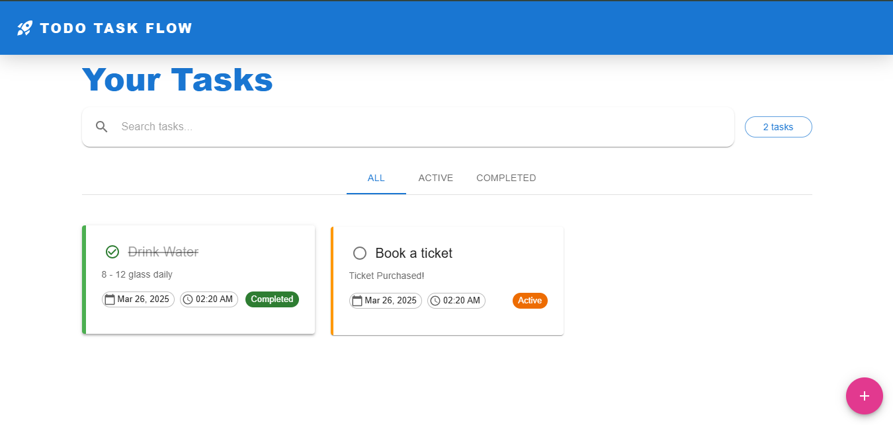

# Todo App (React + Apollo Client Frontend)

A modern frontend for the Todo GraphQL API, built using React, TypeScript, and Apollo Client. This project follows best practices for state management, UI design, and GraphQL querying.

## 🎥 Frontend UI Demo

[](public/demo/Todo-App-Frontend-Demo.mp4)


## Features

- Modern UI with Material-UI
- GraphQL API integration using Apollo Client
- Component-based architecture
- TypeScript for type safety
- React Router for navigation
- Environment-based API configuration
- Fully responsive design

## Technology Stack

- **Framework:** React (Vite)
- **GraphQL Client:** Apollo Client
- **UI Library:** Material-UI
- **State Management:** Apollo Cache Management
- **Language:** TypeScript

## Getting Started

### Prerequisites

1. Install Node.js 18+  
2. Install a package manager (npm)  

### Installation

#### 1. Clone the repository
```sh
git clone https://github.com/muhammad-ata123/Todo-app-frontend.git
```

#### 2. Navigate to the project directory
```sh
cd Todo-app-frontend
```

#### 3. Install dependencies
```sh
npm install
```

#### 4. Create environment variables file
```sh
touch .env
```

## Environment Variables

The project uses the following environment variables:


```env
Note: copy this line and paste into the .env file 

VITE_GRAPHQL_BACKEND_URL=`http://localhost:3000/graphql`
```

### Running the Application  

#### Development Mode  
Start the development server with hot-reloading.
```sh
npm run dev
```

#### Production Mode  
Build and serve the optimized frontend.

The application runs on `http://localhost:5173` by default.

## Project Structure
The project is structured as follows:

- **Components:** Reusable UI components (Header, Footer, TodoList, etc.)
- **Pages:** Views like Home and TodoDetailPage
- **GraphQL:** Queries, mutations, and fragments
- **Utils:** Shared utility functions and types
- **Assets:** Static files like images and icons
- **Styles:** Global and component-specific styles


## GraphQL Integration  

The frontend interacts with the GraphQL API using Apollo Client. It includes:

- Queries to fetch todos and details
- Fragments: Used to ensure efficient and reusable GraphQL queries.
- Mutations to create, update, and delete todos
- TypeScript Typing: All GraphQL responses are strongly typed using Apollo Client’s TypeScript support
- Apollo cache management for optimized performance

## UI & Styling  

The UI follows Material-UI best practices, ensuring:

- A clean and modern design
- Theme customization support
- Fully responsive layout

## Best Practices  

### 1. Component-Based Design  
The app is modular with reusable components.

### 2. Type Safety  
TypeScript is used throughout the project.

### 3. Optimized GraphQL Fetching  
Apollo Client handles caching and efficient data fetching.

## Deployment  

### Build Process  
The project can be built for production using Vite.

### Deployment Options  
- Static hosting (e.g., Vercel, Netlify)  
- Dockerized deployment  
- Integration with backend services  

## License  

No License  
